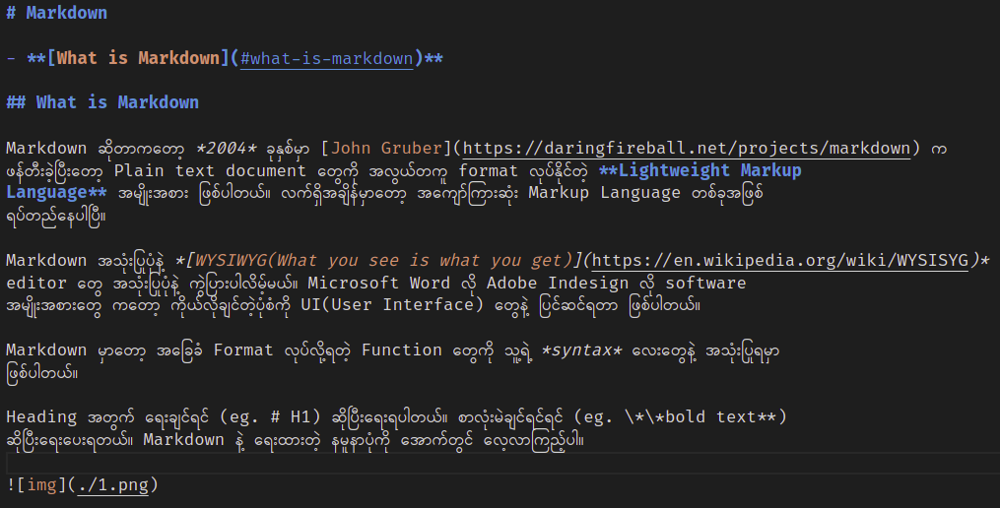
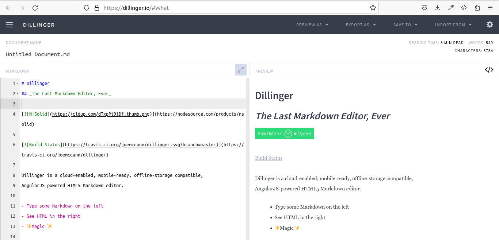
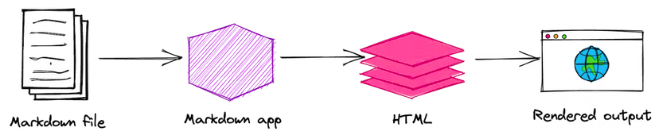
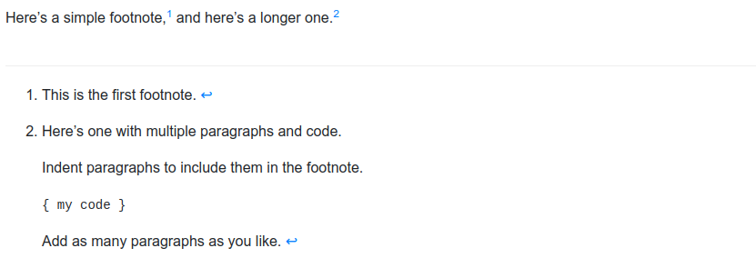

# <center>Markdown</center>

- **[What is Markdown](#what-is-markdown)**
- **[Why use Markdown](#why-use-markdown)**
- **[Kicking the Tires](#kicking-the-tires)**
- **[How does it work?](#how-does-it-work)**
- **[Markdown Applications](#markdown-applications)**
- **[Markdown Cheatsheet](#markdown-cheatsheet)**
- **[Basic Syntax](#basic-syntax)**
- **[Extended Syntax](#extended-syntax)**

## What is Markdown

*Markdown* ဆိုတာကတော့ *2004* ခုနှစ်မှာ [John Gruber](https://daringfireball.net/projects/markdown) က ဖန်တီးခဲ့ပြီးတော့ Plain text document တွေကို အလွယ်တကူ format လုပ်နိုင်တဲ့ **Lightweight Markup Language** အမျိုးအစား ဖြစ်ပါတယ်။ လက်ရှိအချိန်မှာတော့ အကျော်ကြားဆုံး Markup Language တစ်ခုအဖြစ် ရပ်တည်နေပါပြီ။  

*Markdown* အသုံးပြုပုံနဲ့ *[WYSIWYG(What you see is what you get)](https://en.wikipedia.org/wiki/WYSISYG)* editor တွေ အသုံးပြုပုံနဲ့ ကွဲပြားပါလိမ့်မယ်။ Microsoft Word လို Adobe Indesign လို software အမျိုးအစားတွေ ကတော့ ကိုယ်လိုချင်တဲ့ပုံစံကို UI(User Interface) တွေနဲ့ ပြင်ဆင်ရတာ ဖြစ်ပါတယ်။  

*Markdown* မှာတော့ အခြေခံ Format လုပ်လို့ရတဲ့ Function တွေကို သူ့ရဲ့ *syntax* လေးတွေနဲ့ အသုံးပြုရမှာ ဖြစ်ပါတယ်။  

Heading အတွက် ရေးချင်ရင် (eg. # H1) ဆိုပြီးရေးရပါတယ်။ စာလုံးမဲချင်ရင်ရင် (eg. \*\*bold text\*\*) ဆိုပြီးရေးပေးရပါတယ်။ *Markdown* နဲ့ ရေးထားတဲ့ နမူနာပုံကို အောက်တွင် လေ့လာကြည့်ပါ။  



> အောက်ဆုံးနားမှာ ရေးထားတဲ့ \\\*\\\*bold text** ဆိုတာတော့ skip လုပ်ထားခြင်းဖြစ်ပါတယ်။ output မှာ `* (Asterisk)` ကိုမြင်စေချင်လို့ `\ (Backslash)` နဲ့ skip လုပ်ထားခြင်း ဖြစ်ပါတယ်။

## Why use Markdown

*Markdown* ကို WYSIWYG Editor တွေထက် အောက်ပါ အကြောင်းအချက်တွေကြောင့် အသုံးများကြပါတယ်။
- နယ်ပယ်စုံအတွက် အသုံးပြုနိုင်တယ်။
    - websites, documents, notes, books, presentations, email messages နဲ့ technical documentations စသည်ဖြင့် နယ်ပယ်စုံအတွက် အသုံးပြုနေကြပါတယ်။     
- Portable ဖြစ်တယ်။
    - *Markdown* format(.md, .markdown) နဲ့ဖိုင်တွေကို ဆော့ဝဲလ်တော်တော်များများမှာ သုံးလို့ရနိုင်ပါတယ်။
- မည်သည့် OS မှာမဆို အသုံးပြုနိုင်တယ်။
- *Markdown* is everywhere.
    - Reddit, Github စတဲ့ Websites တွေကို *Markdown* ကို ထောက်ပံ့ပေးပါတယ်။ Desktop နဲ့ Web-based Application တော်တော်များများမှာလည်း *Markdown* ကို ထောက်ပံ့ပေးကြပါတယ်။

## Kicking the Tires

*Markdown* ကို စမ်းလို့ရတဲ့ Online tool တွေအများကြီး ရှိပါတယ်။ [Dillinger](https://dillinger.io) ကို အသုံးပြုပြီး စမ်းကြည့်နိုင်ပါတယ်။ ညွှန်းဆိုလိပ်စာကို ဝင်ပြီး *Markdown Syntax* တွေ စမ်းကြည့်လို့ ရပါပြီ။ ဘယ်ဘက်အပိုင်းမှာ Syntax တွေရေးရမှာဖြစ်ပြီး ရေးလိုက်တာတွေ ဘယ်လိုပေါ်မလဲဆိုတာ ညာဘက်အခြမ်းမှာ ပေါ်လာမှာဖြစ်ပါတယ်။



## How does it work?

*Markdown* ကိုသုံးဖို့အတွက် ၎င်းကို ထောက်ပံ့ပေးတဲ့ မည်သည့် software မှာမဆို အသုံးပြုနိုင်ပါတယ်။ Markdown Application တွေဟာ **Markdown Processor(Markdown Parser)** ကိုသုံးပြီးတော့ ကျွန်တော်တို့ ရေးသားထားတဲ့ .md ထဲက syntax တွေကို `HTML` အနေနဲ့ ပြောင်းလဲ ပြသပေးမှာ ဖြစ်ပါတယ်။ ဒါကြောင့် md တွေဟာ web browser တွေပေါ်မှာလည်း အလုပ်လုပ်ဆောင်နိုင်ပါတယ်။ style တွေကို ကိုယ်ပိုင်သတ်မှတ်လိုလျင်လည်း သတ်မှတ်နိုင်ပါတယ်။ ယခုစာအုပ်မှာ Github style markdown format ကို အသုံးပြုထားတာဖြစ်ပါတယ်။



အဆင့် (၄) ဆင့်နဲ့ Markdown ဖိုင်တစ်ခုကို အလုပ်လုပ်ပေးနေပါတယ်။  
1. .md ဖိုင်ကို *Text Editor* သို့မဟုတ် *Markdown Application* တစ်ခုခုကိုနဲ့ တည်ဆောက်လိုက်ပါ။
2. ၎င်းဖိုင်ကို Markdown Application တစ်ခုနဲ့ ဖွင့်လိုက်ပါ။
3. Markdown Application က ၎င်းဖိုင်ကို HTML ဖိုင်ဖြစ် ပြောင်းပေးပါတယ်။
4. နောက်ဆုံးအဆင့်နေနဲ့ ပြောင်းလို့ရလာတဲ့ HTML ဖိုင်ကို web browser တွေမှာ ကြည့်ရှုလို့ရမှာပါ။ *`PDF`* လို format ကိုပြောင်းချင်ရင် Markdown Application အများစုမှာ ပြောင်းလို့ရနိုင်ပါတယ်။

## Markdown Applications

Markdown ကို Platform အားလုံးမှာ သုံးလို့ကောင်းမယ့် application တွေကို စုစည်းပေးလိုက်ပါတယ်။

- **`Mac:`** [MacDown](https://www.markdownguide.org/tools/macdown/), [iA Writer](https://www.markdownguide.org/tools/ia-writer/), [Marked 2](https://www.markdownguide.org/tools/marked-2/)
- **`iOS/Android:`** [iA Wirter](https://www.markdownguide.org/tools/ia-writer/)
- **`Windows:`** [ghostwriter](https://kde.github.io/ghostwriter/), [Markdown Monster](https://kde.github.io/ghostwriter/)
- **`Linux:`** [ReText](https://github.com/retext-project/retext), [ghostwriter](https://kde.github.io/ghostwriter/)
- **`Web:`** [Dillinger](https://kde.github.io/ghostwriter/), [StackEdit](https://kde.github.io/ghostwriter/)

> ယခုစာအုပ်မှာတော့ [Visual Studio Code](https://code.visualstudio.com/) ကို အသုံးပြုပြီး ရေးသားထားတာဖြစ်ပါတယ်။ default အတိုင်းကို ရေးလို့ရပါတယ်။ သို့ပေမဲ့ [Markdown All in One](https://marketplace.visualstudio.com/items?itemName=yzhang.markdown-all-in-one) နဲ့ [Markdown Emoji](https://marketplace.visualstudio.com/items?itemName=bierner.markdown-emoji) ဆိုတဲ့ **Extension** နှစ်ခုကို ထည့်လိုက်ရင် ပိုပြည့်စုံသွားပါပြီ။

## Markdown Cheatsheet

ဒီအပိုင်းမှာကို Markdown ရဲ့ *syntax* တွေကို ခြုံငုံပြီးတော့ အတိုချုံးပြီး ပြောပြပေးသွားမှာ ဖြစ်ပါတယ်။

### Basic Syntax

ဒီ *syntax* တွေဟာ Markdown Application အားလုံးမှာလည်း ထောက်ပံ့ပြီး ရေးသားလို့ ရပါတယ်။

| Element | Markdown Syntax |
|----| --- |
| [Heading](#headings) | # H1<br>## H2<br>### H3 |
| [Bold](#bold) | \*\*bold text\*\* |
| [Italic](#italic) | \*Italicized text\* |
| [Blockquote](#blockquote) | > blockquote |
| [Ordered List](#ordered-list) | 1. First<br>2. Second<br>3. Third |
| [Unordered List](#unordered-list) | - First<br>- Second<br>- Third |
| [Code](#code) | \`code\` |
| [Horizontal Rule](#horizontal-rule) | --- |
| [Link](#link) | [title][https://www.sample.com] |
| [Image](#image) | ![alt text][image.jpg] |

### Extended Syntax

ဒီ *syntax* တွေကတော့ *basic syntax* တွေကို ထပ်ပြီး ပေါင်းထည့်ထားတာပါ။ ဒါကြောင့် Markdown Application အကုန်လုံးတော့ **extended syntax** တွေကို ထောက်ပံ့မှာ မဟုတ်ပါဘူး။

| **Element** | **Markdown Syntax** |
| ---- | ---- |
| [Table](#table) | \| Header1 \| Header2 \|<br>\| ----------- \| ------------ \|<br>\| Data1 \| Data2 \|<br>\| Data3 \| Data4 \| |
| [Fenced Code Block](#fenced-code-block) | ```<br>{<br>"firstName": "John",<br>"lastName": "Doe",<br>"age": 20<br>}<br>\`\`\` |
| [Footnote](#footnote) | Here's a sentence with a footnote. [^1]<br><br>[^1]: This is the footnote. |
| [Heading ID](#heading-id) | ## My Heading {#custom-id} |
| [Definition List](#definition-list) | term<br>: definition |
| [Strikethrough](#strikethrough) | \~\~strikethrough text\~\~ |
| [Task List](#task-list) | - \[ x \] write the press release<br>- \[  &nbsp;&nbsp;&nbsp;\] update the website<br>- \[  &nbsp;&nbsp;&nbsp;\] contact the media |
| [Emoji](#emoji) | I : heart : you. |
| [Highlight](#highlight) | I need to highlight these ==very important words==. |
| [Superscript](#superscript) | X^2^ |
| [Subscript](#subscript) | H~2~O |

## Basic Syntax

ဒီအပိုင်းမှာတော့ အပေါ်မှာ အတိုချိုးပြောပြပေးခဲ့တာတွေကို အသေးစိတ်ပြန်ပြီး ပြောပြပေးသွားမှာ ဖြစ်ပါတယ်။

### Headings

Heading တွေအတွက် ရေးမယ်ဆိုရင်တော့ **# (Number Sign)** ကို ရှေ့မှာထားပြီး ရေးရပါတယ်။ **#** တစ်ခုဆို H1, နှစ်ခုဆို H2 စသည်ဖြင့် H6 ထိ ရှိပါတယ်။

> CSS တွေကို ကိုယ်တိုင်သတ်မှတ်ပေးရမှာဖြစ်ပါတယ်။ Default အတိုင်းဆို Markdown တွေမှာ CSS ပါဝင်လာခြင်း မရှိပါဘူး။ ယခုသတ်မှတ်ထားတဲ့ Heading 1 CSS မှာ hr တစ်ခုကို ထည့်ပေးထားတာ ဖြစ်ပါတယ်။

| Markdown | HTML | Rendered Output |
| ---- | ---- | ---- |
| # Heading Level 1 | \<h1>Heading Level 1\</h1> | <h1>Heading Level 1</h1> |
| ## Heading Level 2 | \<h2>Heading Level 2\</h2> | <h2>Heading Level 2</h2> |
| ### Heading Level 3 | \<h3>Heading Level 3\</h3> | <h3>Heading Level 3</h3> |
| #### Heading Level 4 | \<h4>Heading Level 4\</h4> | <h4>Heading Level 4</h4> |
| ##### Heading Level 5 | \<h5>Heading Level 5\</h5> | <h5>Heading Level 5</h5> |
| ###### Heading Level 6 | \<h6>Heading Level 6\</h6> | <h6>Heading Level 6</h6> |

<br><br><br><br>    
#### Alternate Syntax

Heading 1 နဲ့ 2 အတွက် တခြား Syntax တစ်ခုဆီ ထပ်ရေးလို့ရပါသေးတယ်။ H1 ဆို === နဲ့ H2 ဆို --- နဲ့ ရေးသားလို့ရပါတယ်။

| Markdown | HTML | Rendered Output |
| ---- | ---- | ---- |
| Heading Level 1<br>============ | \<h1>Heading Level 1\</h1> | <h1>Heading Level 1</h1> |
| Heading Level 2<br>--------------------- | \<h2>Heading Level 2\</h2> | <h2>Heading Level 2</h2> |

> = နဲ့ - ကို တစ်ခု (သို့) တစ်ခုထပ်ပိုပြီး ကြိုက်သလောက်သတ်မှတ်လို့ရပါတယ်။ တစ်ခုတည်းဆိုတည်း ရပါတယ်။ 

#### Heading Best Practices

Heading တွေရေးတဲ့အခါမှာတော့ # နဲ့ heading name ကြားမှာ space ခြားပြီးရေးတာ အကောင်းဆုံးဖြစ်ပါတယ်။ space မခြားရင် တစ်ချို့ Markdown appcliation တွေမှာ ရပေမဲ့ တချို့တွေမှာမရပါဘူး။

| :heavy_check_mark: Do this | :X: Don't do this |
| ---- | ---- |
| # Here's a Heading | #Here's a Heading |

Heading တွေမှာ နောက်တစ်ခုအနေနဲ့ heading ရဲ့ အပေါ်နဲ့ အောက်မှာ လိုင်းအလွတ် ထားပေးသင့်ပါတယ်။

| :heavy_check_mark: Do this | :X: Don't do this |
| ---- | ---- |
| Try to put a blank line before...<br><br># Heading<br><br>...and after a heading. | Try to put a blank line before...<br># Heading<br>...and after a heading. | #Here's a Heading |

> ယခု ဇယားမှာ ဖော်ပြထားတာတွေက ရေးသားသင့်တဲ့ပုံစံကို ပြောပြနေခြင်းဖြစ်ပါတယ်။ Output မှာတော့ Whitespace တွေကို ထည့်သွင်း ဖော်ပြသွားမှာမဟုတ်ပါဘူး။ Whitespace တွေပါ ဖော်ပြတဲ့ *syntax* သပ်သပ်ရှိပါတယ်။ နောက်အခန်းတွေမှာ ဆက်လက် ဖော်ပြပေးပါမယ်။

### Paragraphs

စာပိုဒ်တွေရေးတဲ့အခါမှာ အရှေ့မှာ Tab တွန်းရင် အလုပ်လုပ်မှာမဟုတ်သလို အဲ့လိုလည်း မရေးသင့်ပါဘူး။

| :heavy_check_mark: Do this | :X: Don't do this |
| ---- | ---- |
| Don't put tabs or spaces in front of your paragraphs.<br><br>Keep lines left-aligned like this. | &nbsp;&nbsp;&nbsp;&nbsp;This can result in unexpected formatting problems.<br><br>&nbsp;&nbsp;&nbsp;Don't add tabs or spaces in front of paragraphs. |

စာပိုဒ်တွေရေးတဲ့အခါ အောက်တစ်ကြောင်းဆင်းပြီး ဖော်ပြ စေချင်ရင် \<br> ဆိုပြီးလည်း ရေးလို့ရသလို့ စာကြောင်းနောက်ဆုံးမှာ space နှစ်ခု (သို့) နှစ်ခုထက်ပိုပြီးခြားပြီး *Enter* ခေါက်လိုက်ရင်လည်း ရပါတယ်။ စာပိုက်ရှေ့မှာ tab (သို့) whitespace တွေထည့်ချင်ရင်တော့ `&nbsp;` ကို ရေးပေးရမှာ ဖြစ်ပါတယ်။

| Markdown | HTML | Rendered Output |
| ---- | ---- | ---- |
| First Sentence of<br>paragraph.\<br>Second<br>Sentence of paragraph.<br>\<br>\<br>Third Sentence of paragraph. | \<p>First Sentence of paragraph.<br>\</p>\<br>\<p>Second Sentence<br>of paragraph.\</p>\<br>\<br><br>\<p>Third Sentence of paragraph.\</p> | First Sentence of paragraph.<br>Second Sentence of paragraph.<br><br>Third Sentence of paragraph. |
| First Sentence of<br>paragraph. `two (or) more`<br>`spaces and hit enter`<br>Second Sentence of paragraph.<br>`(two (or) more spaces and`<br>`hit enter) x 2`Third Sentence of paragraph. | \<p>First Sentence of paragraph.<br>\</p>\<br>\<p>Second Sentence<br>of paragraph.\</p>\<br>\<br><br>\<p>Third Sentence of paragraph.\</p> | First Sentence of paragraph.<br>Second Sentence of paragraph.<br><br>Third Sentence of paragraph. |
| \&nbsp;\&nbsp;\&nbsp;\&nbsp;The<br>sentence with tab<br>white space from beginning. | \<p>\&nbsp;\&nbsp;\&nbsp;\&nbsp;The<br>sentence with tab<br>white space from beginning.\</p> | &nbsp;&nbsp;&nbsp;&nbsp;The sentence with tab white space from beginning. |

> `two (or) more spaces and hit enter` ဆိုတာ *Computer Keyborad* ရဲ့ space button နဲ့ enter button ကို နှိပ်ရမှာ ဖြစ်ပါတယ်။
<br>

> `two (or) more spaces and hit enter` အစာ `Enter' နှစ်ခါခေါက်လိုက်ရင်လည်း အောက်တစ်ကြောင်း ဆင်းပေးသွားပါတယ်။ ဒါပေမဲ့ line spacing တော့ နဲနဲကျဲကျဲလေး ဖြစ်သွားပါလိမ့်မယ်။ ကိုယ်တိုင်ပဲ စမ်းကြည့်လိုက်ပါ။

> \&nbsp; ဆိုရင် space တစ်ချက်စာ ရပါတယ်။ Tab ကိုလိုချင်ရင်တော့ (\&nbsp;)x4 ဆို tab တစ်ချက်စာ ရနိုင်ပါတယ်။

အခြားအသုံးဝင်မယ့် symbol လေးတွေကိုလည်း တစ်လက်စတည်း ဖော်ပြပေးလိုက်ပါတယ်။

- Copyright (&copy;) - \&copy;
- Register trademark (&reg;) - \&reg;
- Trademark (&trade;) - \&trade;
- Euro (&euro;) - \&euro;
- Left arrow (&larr;) - \&larr;
- Right arrow (&rarr;) - \&rarr;
- Up arrow (&uarr;) - \&uarr;
- Down arrown (&darr;) - \&darr;
- Space (&nbsp;) - \&nbsp;
- Less than (&lt;) - \&lt;
- Grater than (&gt;) - \&gt;
- Degree (&#176;) - \&#176;
- Pi (&#960;) - \&#960;

### Emphasis

ဒီတစ်ခါတော့ စာလုံးတွေကို စောင်း၊ စာလုံးထူ ရေးဖို့အတွက် *syntax* တွေကို ဆက်လေ့လာကြည့်ရအောင်။

#### Bold

| Markdown | HTML | Rendered Output |
| ---- | ---- | ---- |
| I just love \*\*bold text**. | I just love \<strong>bold text\</strong>. | I just love **bold text**. |
| I just love \_\_bold text__. | I just love \<strong>bold text\</strong>. | I just love **bold text**. |
| Love\*\*is**bold | Love\<strong>is\</strong>bold | Love**is**bold |

> Markdown application တွေအားလုံးလိုလိုမှာတော့ * ကိုသုံးတာကို ပိုပြီး preferred လုပ်ကြပါတယ်။ _ ကိုတော့ သုံးဖို့ မတိုက်တွန်းကြပါဘူး။ ဒါကြောင့် bold အတွက် * ကိုပဲ သုံးတဲ့ အကျင့်ကို လုပ်စေချင်ပါတယ်။

#### Italic

| Markdown | HTML | Rendered Output |
| ---- | ---- | ---- |
| I hate \*war*. | I hate \<em>war\</em>. | I hate *war*. |
| I hate \_war_. | I hate \<em>war\</em>. | I hate *war*. |
| Ihate\*war*. | Ihate\<em>war\</em>. | Ihate*war*. |

> ဒီမှာလည်း * ကိုပဲ ပိုပြီး preferred လုပ်ပါတယ်။

#### Bold and Italic

စာလုံးထူနဲ့ စာလုံးစောင်းကို တပြိုင်နက်သုံးခြင်ရင်တော့ အောက်ပါရေးနည်းများနဲ့ ရေးသားနိုင်ပါတယ်။

| Markdown | HTML | Rendered Output |
| ---- | ---- | ---- |
| Money is \*\*\*really important\*\*\*. | Money is \<em>\<strong>really important<br>\</strong>\</em>. | Money is ***really important***. |
| Money is \_\_\_really important___. | Money is \<em>\<strong>really important<br>\</strong>\</em>. | Money is ***really important***. |
| Money is \_\_\*really important\*\_\_. | Money is \<em>\<strong>really important<br>\</strong>\</em>. | Money is ***really important***. |
| Money is \*\*\_really important\_\*\*. | Money is \<em>\<strong>really important<br>\</strong>\</em>. | Money is ***really important***. |
| Money is really\*\*\*important\*\*\*thing. | Money is really\<em>\<strong>important<br>\</strong>\</em>thing. | Money is really***important***thing. |

> Bold and italic ကိုသုံးမယ်ဆိုရင်လည်း *** ကိုပဲ သုံးဖို့ preferred လုပ်ပါတယ်။

### Blockquote

Blockquote ကိုရေးသားဖို့ စာပိုဒ်ရဲ့အရှေ့မှာ *>* ကို ထည့်ပေးရပါမယ်။

`> Dorothy followed her through many of the beautiful rooms in her castle.`

ရလဒ်အနေနဲ့ ယခုလို မြင်ရပါတယ်။

> Dorothy followed her through many of the beautiful rooms in her castle.

#### Blockquotes with multiple paragraphs

တစ်ခုမကသော စာပိုဒ်တွေနဲ့ blockquote နဲ့ ရေးချင်ရင်

```
> Dorothy followed her through many of the beautiful rooms in her castle.
>
> The Witch bade her clean the pots and kettles and sweep the floor and keep the fire fed with wood.
```

ရလဒ်အနေနဲ့ ယခုလို မြင်ရပါတယ်။

> Dorothy followed her through many of the beautiful rooms in her castle.
>
> The Witch bade her clean the pots and kettles and sweep the floor and keep the fire fed with wood.

#### Nested Blockquotes

Nested blockquote တွေလည်း ရေးလို့ရပါတယ်။

```
> Dorothy followed her through many of the beautiful rooms in her castle.
>
>> The Witch bade her clean the pots and kettles and sweep the floor and keep the fire fed with wood.
```

ယခုလို မြင်ရပါတယ်။

> Dorothy followed her through many of the beautiful rooms in her castle.
>
>> The Witch bade her clean the pots and kettles and sweep the floor and keep the fire fed with wood.

#### Blockquotes with other elements

ရှေ့မှာ လေ့လာခဲ့ပြီးသော element တွေနဲ့လည်း ပေါင်းစပ်ရေးသားလို့ရပါတယ်။

```
> #### The quarterly results look great!
>
> - Revenue was off the chart.
> - Profits were higher than ever.
>
>  *Everything* is going according to **plan**.
```

> #### The quarterly results look great!
>
> - Revenue was off the chart.
> - Profits were higher than ever.
>
>  *Everything* is going according to **plan**.

> **blockquote တွေရေးရင်လည်း ၎င်းတို့ရဲ့ အပေါ်နဲ့အောက်မှာ လိုင်းအလွတ်တစ်ကြောင်းစီ ထည့်ပြီးရေးသားတဲ့ အကျင့်ကို လုပ်သင့်ပါတယ်။**

### Ordered List

| Markdown | HTML | Rendered Output |
| ---- | ---- | ---- |
| 1. First item<br>2. Second item<br>3. Third item<br>4. Fourth item | \<ol><br>&nbsp;&nbsp;&nbsp;\<li>First item\</li><br>&nbsp;&nbsp;&nbsp;\<li>Second item\</li><br>&nbsp;&nbsp;&nbsp;\<li>Third item\</li><br>&nbsp;&nbsp;&nbsp;\<li>Fourth item\</li><br>\</ol> | 1. First item<br>2. Second item<br>3. Third item<br>4. Fourth item |
| 1\. First item<br>1\. Second item<br>1\. Third item<br>1\. Fourth item | \<ol><br>&nbsp;&nbsp;&nbsp;\<li>First item\</li><br>&nbsp;&nbsp;&nbsp;\<li>Second item\</li><br>&nbsp;&nbsp;&nbsp;\<li>Third item\</li><br>&nbsp;&nbsp;&nbsp;\<li>Fourth item\</li><br>\</ol> | 1. First item<br>2. Second item<br>3. Third item<br>4. Fourth item |
| 1. First item<br>8. Second item<br>3. Third item<br>5. Fourth item | \<ol><br>&nbsp;&nbsp;&nbsp;\<li>First item\</li><br>&nbsp;&nbsp;&nbsp;\<li>Second item\</li><br>&nbsp;&nbsp;&nbsp;\<li>Third item\</li><br>&nbsp;&nbsp;&nbsp;\<li>Fourth item\</li><br>\</ol> | 1. First item<br>2. Second item<br>3. Third item<br>4. Fourth item |
| 1. First item<br>2. Second item<br>3. Third item<br>&nbsp;&nbsp;&nbsp;5. indented item<br>&nbsp;&nbsp;&nbsp;2. indented item<br>4. Fourth item | \<ol><br>&nbsp;&nbsp;&nbsp;\<li>First item\</li><br>&nbsp;&nbsp;&nbsp;\<li>Second item\</li><br>&nbsp;&nbsp;&nbsp;\<li>Third item\</li><br>&nbsp;&nbsp;&nbsp;&nbsp;&nbsp;\<ol><br>&nbsp;&nbsp;&nbsp;&nbsp;&nbsp;&nbsp;&nbsp;&nbsp;\<li>indented item\</li><br>&nbsp;&nbsp;&nbsp;&nbsp;&nbsp;&nbsp;&nbsp;&nbsp;\<li>indented item\</li><br>&nbsp;&nbsp;&nbsp;&nbsp;&nbsp;\</ol><br>&nbsp;&nbsp;&nbsp;\<li>Fourth item\</li><br>\</ol> | 1. First item<br>2. Second item<br>3. Third item<br>&nbsp;&nbsp;&nbsp;5. indented item<br>&nbsp;&nbsp;&nbsp;2. indented item<br>4. Fourth item |

> Sub List တွေရေးရင် သူ့ရဲ့အပေါ်ကြောင်းမှာ space နှစ်ချက်ထားပေးထားရပါတယ်။ ပြီးရင် sub list ရဲ့အရှေ့မှာ space သုံးချက်ခြားပြီးရေးပေးရပါတယ်။ နမူနာမှာဆိုရင် Third item နဲ့ 1. indented item ရဲ့နောက်မှာ space နှစ်ချက်စီပါပြီး sub list နှစ်ခုလုံးရဲ့အရှေ့မှာ space သုံးချက်စီ ပါပါတယ်။

> နောက်တစ်ခုမှတ်ထားသင့်တဲ့အချက်ကတော့ main list တွေကိုနံပါတ်မှန်အောင် မတပ်ပေးလည်း output မှာ နံပါတ်ကို ပြန်စဥ်ပေးပေမဲ့ sub list တွေကိုတော့ စဥ်ပေးမှာမဟုတ်ပါဘူး။

### Unordered List

unordered list တွေကို `-` `*` `+` စတာတွေနဲ့ ရေးသားလို့ ရပါတယ်။

| Markdown | HTML | Rendered Output |
| ---- | ---- | ---- |
| - First item<br>- Second item<br>- Third item<br>- Fourth item | \<ul><br>&nbsp;&nbsp;&nbsp;\<li>First item\</li><br>&nbsp;&nbsp;&nbsp;\<li>Second item\</li><br>&nbsp;&nbsp;&nbsp;\<li>Third item\</li><br>&nbsp;&nbsp;&nbsp;\<li>Fourth item\</li><br>\</ul> | **•** First item<br>**•** Second item<br>**•** Third item<br>**•** Fourth item |
| * First item<br>* Second item<br>* Third item<br>* Fourth item | \<ul><br>&nbsp;&nbsp;&nbsp;\<li>First item\</li><br>&nbsp;&nbsp;&nbsp;\<li>Second item\</li><br>&nbsp;&nbsp;&nbsp;\<li>Third item\</li><br>&nbsp;&nbsp;&nbsp;\<li>Fourth item\</li><br>\</ul> | **•** First item<br>**•** Second item<br>**•** Third item<br>**•** Fourth item |
| + First item<br>+ Second item<br>+ Third item<br>+ Fourth item | \<ul><br>&nbsp;&nbsp;&nbsp;\<li>First item\</li><br>&nbsp;&nbsp;&nbsp;\<li>Second item\</li><br>&nbsp;&nbsp;&nbsp;\<li>Third item\</li><br>&nbsp;&nbsp;&nbsp;\<li>Fourth item\</li><br>\</ul> | **•** First item<br>**•** Second item<br>**•** Third item<br>**•** Fourth item |
| - First item<br>- Second item<br>- Third item<br>&nbsp;&nbsp;&nbsp;- indented item<br>&nbsp;&nbsp;&nbsp;- indented item<br>- Fourth item | \<ul><br>&nbsp;&nbsp;&nbsp;\<li>First item\</li><br>&nbsp;&nbsp;&nbsp;\<li>Second item\</li><br>&nbsp;&nbsp;&nbsp;\<li>Third item\</li><br>&nbsp;&nbsp;&nbsp;&nbsp;&nbsp;\<ul><br>&nbsp;&nbsp;&nbsp;&nbsp;&nbsp;&nbsp;&nbsp;&nbsp;\<li>indented item\</li><br>&nbsp;&nbsp;&nbsp;&nbsp;&nbsp;&nbsp;&nbsp;&nbsp;\<li>indented item\</li><br>&nbsp;&nbsp;&nbsp;&nbsp;&nbsp;\</ul><br>&nbsp;&nbsp;&nbsp;\<li>Fourth item\</li><br>\</ul> | **•** First item<br>**•** Second item<br>**•** Third item<br>&nbsp;&nbsp;&nbsp;**◦** indented item<br>&nbsp;&nbsp;&nbsp;**◦** indented item<br>**•** Fourth item |

#### Starting unordered list with numbers

unorderd list တွေကို number တွေပါခဲ့ရင်(နမူနာပုံစံလို) ordered list syntax နဲ့ တူသွားတဲ့အတွက် `\` နဲ့ escape လုပ်ပေးဖို့ လိုပါတယ်။- 

| Markdown | HTML | Rendered Output |
| ---- | ---- | ---- |
| - 1968\\. A great year!<br>- I think 1969 was second best. | \<ul><br>&nbsp;&nbsp;&nbsp;\<li>1968. A great year!\</li><br>&nbsp;&nbsp;&nbsp;\<li> think 1969 was<br>&nbsp;&nbsp;&nbsp;&nbsp;&nbsp;&nbsp;&nbsp;&nbsp;&nbsp;&nbsp;second best.\</li><br>\</ul> | **•** 1968. A great year!<br>**•** I think 1969 was second best. |

#### Adding element in list

list တွေထဲမှာ အခြား element တွေနဲ့ ရောပြီး ရေးခြင်ရင်လည်း ရေးလို့ ရပါတယ်။<br><br><br>

##### Paragraph

list ထဲမှာ paragraph ထည့်ရေးခြင်ရင်တော့ စာပိုဒ်ရေးတဲ့အတိုင်း ပေါ်ကလိုင်းက space နှစ်ချက်ခြားပြီး paragraph လိုင်းရဲ့အရှေ့မှာတော့ space လေးချက်(သို့) Tab တစ်ချက်ခြားပြီး ရေးသားလို့ရပါတယ်။ ဒါမှမဟုတ်လည်း `Enter` နှစ်ချက်ခေါက်ပြီး ရေးသားနိုင်ပါတယ်။

```
* This is the first list item.
* Here's the second list item.

    I need to add another paragraph below the second list item.

* And here's the third list item
```

ရလဒ်အနေနဲ့ ယခုလို မြင်ရပါတယ်။

- This is the first list item.
- Here's the second list item.

    I need to add another paragraph below the second list item.

- And here's the third list item

##### Blockquotes

```
* This is the first list item.
* Here's the second list item.

    > A blockquote would look great below the second list item.

* And here's the third list item.
```

ယခုလို မြင်ရပါတယ်။

* This is the first list item.
* Here's the second list item.

    > A blockquote would look great below the second list item.

* And here's the third list item.

##### Code Blocks

ပုံမှန် code block တွေရေးမှန်ဆိုရင် space လေးချက် (သို့) tab တစ်ချက်နဲ့ ရေးပေးရပါတယ်။ list တွေထဲမှာရေးရင်တော့ space ရှစ်ချက် (သို့) tab နှစ်ချက် ထည့်ပေးရပါတယ်။

```
1. Open the file.
2. Find the following code block on line 21:

        <html>
          <head>
            <title>Test</title>
          </head>
        </html>

3. Update the title to match the name of your website.
```

ရလဒ်ကတော့ အခုလိုဖြစ်ပါတယ်။

1. Open the file.
2. Find the following code block on line 21:

        <html>
          <head>
            <title>Test</title>
          </head>
        </html>

3. Update the title to match the name of your website.

##### Images

```
1. Open the file containing the Linux mascot.
2. Marvel at its beauty.

    

3. Close the file.
```

အောက်ပါအတိုင်း ရလဒ်ရပါတယ်။

1. Open the file containing the Linux mascot.
2. Marvel at its beauty.

    

3. Close the file.

##### List

ordered list ထဲမှာ unordered list တွေထည့်ရေးနိုင်သလို၊ unordered list တွေထဲမှာလည်း ordered list တွေ ထည့်ရေးလို့ရပါတယ်။

```
1. First item
2. Second item
3. Third item
    - Indented item
    - Indented item
4. Fourth item
```
ယခုလို ရရှိပါတယ်။

1. First item
2. Second item
3. Third item
    - Indented item
    - Indented item
4. Fourth item
<br><br><br><br><br><br><br><br>
### Code

စကားလုံးတစ်လုံး၊ စကားစုတစ်စုကို အမှတ်အသားပေးခြင်ရင် **Backticks (`)** နဲ့ ရေးသားလို့ ရပါတယ်။

| Markdown | HTML | Rendered Output |
| ---- | ---- | ---- |
| At the command prompt, type \`nano\`. | At the command prompt, type \<code>nano\</code>. | At the command prompt, type `nano`. |

#### Escaping Backticks

code syntax တစ်ကြောင်းမှာ backtick တစ်ခုမက ပိုပါနေတယ်ဆိုရင် backtick တစ်ခုထပ်ငုံပြီး escape လုပ်နိုင်ပါတယ်။

| Markdown | HTML | Rendered Output |
| ---- | ---- | ---- |
| \`\`Use \`code\` in your Markdown file.\`\` | \<code>Use `code` in your Markdown file.\</code> | ``Use `code` in your Markdown file.`` |

#### Code Blocks

`code block` တွေရေးချင်ရင်တော့ code block line တိုင်းရဲ့ ရှေ့မှာ space လေးချက် (သို့) tab တစ်ချက်ကို ထည့်ပေးရပါတယ်။

```
    <html>
        <head>
        </head>
    </html>
```
ယခုလို ရရှိပါတယ်။

    <html>
      <head>
      </head>
    </html>

### Horizontal Rule

အလျားလိုက်မျဥ်းတစ်ကြောင်း ရေးသားချင်ရင်သုံးပါတယ်။ ရေးသားပုံကတော့ asterisks(***), dashes(---) or underscores (___) တို့ကို သုံးခု (သို့) သုံးခုထက်ပိုပြီး ရေးသားရင် ရပါတယ်။

```
***

---

_________
```

အပေါ်မှာဖော်ပြခဲ့သလို ဘယ်လိုပဲ ရေးရေး ရလဒ်က အောက်ပါအတိုင်းဖြစ်ပါတယ်။

---

> **Horizontal Rule** ကိုရေးမယ်ဆိုရင်လည်း အပေါ်နဲ့ အောက်မှာ မျဥ်းအလွတ်တစ်ကြောင်းစီ ခြားထားသင့်ပါတယ်။

### Link

```
My favorite search engine is [Microsoft Bing](https://bing.com)
```

ရလဒ်အနေနဲ့ ယခုလို ရပါတယ်။

My favorite search engine is [Microsoft Bing](https://bing.com)

#### Adding Titles

link မှာ title ထည့်ချင်ရင်လည်း ထည့်လို့ ရပါတယ်။

```
My favorite search engine is [Microsoft Bing](https://bing.com "The best search engine ever")
```
link ပေါ်ကို mouse လေးတင်လိုက်တာနဲ့ ကျွန်တော်တို့ ထည့်လိုက်တဲ့ title လေးကို ဖော်ပြပေးမှာဖြစ်ပါတယ်။

My favorite search engine is [Microsoft Bing](https://bing.com "The best search engine ever")

#### URLs and Email Addresses

Link တွေကို နောက်တစ်နည်းလည်း ရေးလို့ရပါသေးတယ်။ `< >` ဖွင့်အပိတ်နဲ့ ရေးသားလို့ ရပါတယ်။

```
<https://www.facebook.com>
<info@facebook.com>
```
ယခုလို တွေ့မြင်နိုင်ပါတယ်။

<https://www.facebook.com>  
<info@facebook.com>

#### Formatting Links

ဒါဆို link တွေကို ရှေ့မှာ လေ့လာခဲ့တဲ့ element များနဲ့ တွဲဖက်ပြီး ရေးသားကြည့်ပါမယ်။

```
I love supporting the **[EFF](https://eff.org)**.
This is the *[Facebook](https://www.facebook.com)*.
See the section on [`code`](#code).
```
ယခုလို ရရှိပါမယ်။

I love supporting the **[EFF](https://eff.org)**.  
This is the *[Facebook](https://www.facebook.com)*.  
See the section on [`code`](#code).

#### Reference-style Links

link တွေကို reference ပုံစံနဲ့လည်း ရေးလေ့ရှိပါတယ်။ ဒီလိုရေးခြင်းအားဖြင့် raw markdown မှာ ပိုဖတ် readable ဖြစ်စေပါတယ်။ reference-style မှာ အပိုင်းနှစ်ပိုင်း ပါပါတယ်။

##### Formatting the First Part of the Link

ပထမအပိုင်းမှာ ထောင့်ကွင်း `[]` အဖွင့်အပိတ် နှစ်ခုစီ ပါပါတယ်။ ပထမထောင့်ကွင်းမှာ link ရဲ့ စာသားကို ရေးပေးရပါတယ်။ နောက်တစ်ခုမှာတော့ ကျွန်တော်တို့ markdown raw ဖိုင် တစ်နေရာရာမှာ ရေးထားတဲ့ link ရဲ့ label ကို ရေးပေးရပါတယ်။  

ပထမကွင်းနဲ့ ဒုတိယကွင်းကြားမှာ space ပါလည်းရသလို မပါလည်း ရပါတယ်။ link label ကို ပေးတဲ့အခါ letters, numbers, spaces, punctuations စတာတွေပေးလို့ရပါတယ်။ အကြီးအသေး ကိစ္စမရှိပါဘူး။ a နဲ့ A ဟာ အတူတူပဲလို့ ဆိုလိုတာဖြစ်ပါတယ်။ နမူနာကို ကြည့်ပါ။

- \[hobbit-hole]\[1]
- [hobbit-hole] [hole]
- [hobbit-hole] [hobbit hole]
- [hobbit-hole] [hobbit-hole]

##### Formatting the Second Part of the Link

ဒုတိယအပိုင်းမှာတော့

1. ပထမအပိုင်း ဒုတိယထောင့်ကွင်းကို ပြန်ရေးပေးရပြီး နောက်မှာ `colon (:)` ထည့်ပေးရပါမယ်။
2. ပြီးရင်တော့ URL ကိုရေးပေးရပါတယ်။ URL ရေးတဲ့အခါ `< >` ကိုထည့်ရေးလည်းရပါတယ်။ မရေးလည်းရပါတယ်။
3. label နဲ့ URL ကြားမှာတော့ space တစ်ခုတော့ ခြားပေးမှ ရပါမယ်။
4. URL ပြီးရင် title ထည့်လို့ရပါသေးတယ်။ title ကို double quotes, single quotes, parentheses အဖွင့်အပိတ်တွေနဲ့ ရေးနိုင်ပါတယ်။

- \[1]: https://en.wikipedia.org/wiki/Hobbit#Lifestyle
- \[1]: https://en.wikipedia.org/wiki/Hobbit#Lifestyle "Hobbit lifestyles"
- \[1]: https://en.wikipedia.org/wiki/Hobbit#Lifestyle 'Hobbit lifestyles'
- \[1]: https://en.wikipedia.org/wiki/Hobbit#Lifestyle (Hobbit lifestyles)
- \[1]: \<https://en.wikipedia.org/wiki/Hobbit#Lifestyle> "Hobbit lifestyles"
- \[1]: \<https://en.wikipedia.org/wiki/Hobbit#Lifestyle> 'Hobbit lifestyles'
- \[1]: \<https://en.wikipedia.org/wiki/Hobbit#Lifestyle> (Hobbit lifestyles)

> ဒုတိယတပိုင်းက document ရဲ့ ဘယ်နေရာဖြစ်ဖြစ်ထားလို့ ရပါတယ်။ဒါပေမဲ့ ပထမအပိုင်းနဲ့ ဒုတိယအပိုင်းကို အပေါ်အောက် ကပ်လျက်ရေးတာ ပိုပြီးကောင်းမယ်လို့ ထင်ပါတယ်။

##### An Example Putting the Parts Together

ဒါဆို link ပါတဲ့ ဥပမာလေး တစ်ခုလောက် ရေးကြည့်ပါမယ်။

```
In a hole in the ground there lived a hobbit. Not a nasty, dirty, wet hole, filled with the ends
of worms and an oozy smell, nor yet a dry, bare, sandy hole with nothing in it to sit down on or to
eat: it was a [hobbit-hole](https://en.wikipedia.org/wiki/Hobbit#Lifestyle "Hobbit lifestyles"), and that means comfort.
```
ဒါကို reference ပုံစံ link နဲ့ ပြန်ရေးကြည့်ပါမယ်။

```
In a hole in the ground there lived a hobbit. Not a nasty, dirty, wet hole, filled with the ends
of worms and an oozy smell, nor yet a dry, bare, sandy hole with nothing in it to sit down on or to
eat: it was a [hobbit-hole][1], and that means comfort.

[1]: <https://en.wikipedia.org/wiki/Hobbit#Lifestyle> "Hobbit lifestyles"
```
ဘယ်လိုရေးရေးအတူတူပဲဆိုပေမဲ့ စာပိုဒ်တစ်ပိုဒ်ကို ဖတ်ရတဲ့အခါ reference က ပိုပြီးရှင်းစေပါတယ်။ ရလဒ်ကတော့ အောက်ပါအတိုင်းပါ။

In a hole in the ground there lived a hobbit. Not a nasty, dirty, wet hole, filled with the ends
of worms and an oozy smell, nor yet a dry, bare, sandy hole with nothing in it to sit down on or to
eat: it was a [hobbit-hole][1], and that means comfort.

[1]: <https://en.wikipedia.org/wiki/Hobbit#Lifestyle> "Hobbit lifestyles"

### Image

image ထည့်ဖို့အတွက် `!` ကို အရင်ရေးပြီး နောက်မှာ alt text လို့ခေါ်တဲ့ image အတွက် caption ရေးပေးရပါတယ်။ ပြီးမှ image ရဲ့ နေရာကို parentheses **( )** ထဲမှာ ရေးပေးရပါတယ်။

``````

image နေရာမှာ Website link ကိုလည်း ညွှန်းဆိုနိုင်သလို ကိုယ့်စက်ထဲမှာရှိတဲ့ တည်နေရာကိုလည်း ထည့်လို့ရပါတယ်။ နောက်မှာ ပုံရဲ့ title ကိုထည့်ထားပါတယ်။ ပုံကို hover လုပ်လိုက်ရင် မြင်ရမဲ့စာကို title ထဲထည့်ပေးရပါတယ်။ အောက်ပါအတိုင်း မြင်ရပါတယ်။


<br><br><br><br><br>
## Extended Syntax

ကျွန်တော်တို့ လေ့လာပြီးခဲ့တဲ့ **Basic Syntax** တွေက *Markdown* ရေးလို့ရတဲ့ application အားလုံးမှာ ရေးသားလို့ရနိုင်ပါတယ်။ ဒါပေမဲ့ format လုပ်ဖို့အတွက်တော့ လုံလောက်ခြင်းမရှိပါဘူး။ ဒါကြောင့်ပဲ format ထပ်ပြီး လုပ်ဖို့အတွက် syntax တွေ ပေါ်လာခဲ့ပါတယ်။  
သက်ဆိုင်ရာ အဖွဲ့အစည်းအချို့က **Basic Syntax** တွေအပြင် ထပ်တိုးပြီး syntax တွေကို ဖန်တီးခဲ့ပါတယ်။ `Tables, code blocks, syntax highlighting, URL auto-linking and footnotes` စတာတွေကို ထပ်ပြီး တိုးခဲ့ပါတယ်။ ၎င်းတို့ကို ရေးသားလို့ရဖို့အတွက်တော့ Basic Syntax ပေါ်မှာ အခြေခံပြီး တည်ဆောက်ထားတဲ့ *Lightweight Markup Language* တစ်ခုကို သုံးလို့ရသလို Markdown Processor နဲ့ Compatible ဖြစ်တဲ့ *Extension* တစ်ခုကို ထည့်ပြီး ရေးသားလို့လည်း ရပါတယ်။  

> ယခုစာအုပ်မှာတော့ `VS Code` ရဲ့ `Markdown All in One` ဆိုတဲ့ *Extension* ကို ထည့်သွင်းပြီး ရေးသားထားပါတယ်။

### Lightweight Markup Languages

Markdown ကို *Basic Syntax* ရော *Extended Syntax* ရော ရေးလို့ရတဲ့ **Lightweight Markup Language** တွေ အများကြီးရှိပါတယ်။

- [Common Mark](https://commonmark.org/)
- [Github Flavored Markdown(GFM)](https://github.github.com/gfm/)
- [Markdown Extra](https://michelf.ca/projects/php-markdown/extra/)
- [MultiMarkdown](https://fletcherpenney.net/multimarkdown/)
- [R Markdown](https://rmarkdown.rstudio.com/)


### Table

**Table** တစ်ခုကို ရေးသားဖို့ Table Header တွေရေးပါမယ်။ Column တစ်ခုနဲ့ တစ်ခုကြား `| (Pipe)` နဲ့ ခြားပါတယ်။ အောက်တစ်ကြောင်းမှာတော့ *Column* တစ်ခုစီအတွက် `--- (Hyphens)` သုံးခု ရေးပေး ရပါတယ်။

```
| Syntax    | Description |
| --------- | ----------- |
| Header    | Title       |
| Paragraph | Text        |
```
ရလဒ်ကတော့ ယခုလို ဖြစ်ပါတယ်။

| Syntax    | Description |
| ------    | ----------- |
| Header    | Title       |
| Paragraph | Text        |

ဒီလိုရေးလည်းအတူတူပါပဲ။

```
Syntax    | Description
--- | ---
Header | Title
Paragraph | Text
```

> အရှေ့နဲ့ အနောက်မှာရှိတဲ့ Pipe တွေကို မရေးလည်းရပါတယ်။ Hyphen ကို သုံးခုပဲရေးလည်းရပါတယ်။ ပိုရေးလည်းရပါတယ်။

#### Alignment

Table alignment ကို သတ်မှတ်တဲ့အခါမှာ hyphen နဲ့ အရှေ့နဲ့ အနောက်မှာ `: (colon)`သတ်မှတ်ပေးနိုင်ပါတယ်။ အရှေ့မှာ ရေးထားရင် *Left Align* ၊ အနောက်မှာ ရေးထားရင် *Right Align* ၊ နှစ်ခုလုံးမှာ ရေးထားရင် *Center Align* ဖြစ်ပါတယ်။ Default အတိုင်းဆို *Left Align* ဖြစ်ပါတယ်။

```
| Syntax    | Description | Test Text   |
| :-------- | :---------: | ----------: |
| Header    | Title       | Here's this |
| Paragraph | Text        | And more    |
```
ရလဒ်ကအောက်ပါအတိုင်း ဖြစ်ပါတယ်။

| Syntax    | Description | Test Text   |
| :-------- | :---------: | ----------: |
| Header    | Title       | Here's this |
| Paragraph | Text        | And more    |

#### Formatting Text in Table

Table ရဲ့ cell အတွင်းမှာ Format လုပ်လို့ရတဲ့ Markdown element တွေအနေနဲ့ links, code (`), and emphasis တို့ဖြစ်ပါတယ်။  

headings, blockquotes, lists, horizontal rules, images နဲ့ အချို့သော html elememnt တွေနဲ့တော့ format လုပ်လို့ မရနိုင်ပါဘူး။

> Table မှာ တစ်ကြောင်းဆင်းလိုလျင် `<br>` သုံးလို့ ရပါတယ်။ list တွေထည့်ချင်ရင် `<ul>, <ol>` သုံးလို့ ရပါတယ်။
>
> Table မှာ `|` ကို output မှာပြချင်ရင် `&#124;` ကို သုံးလို့ရပါတယ်။

### Fenced Code Block

ပုံမှန်တိုင်းဆို *Basic Markdown Syntax* မှာ **Code Block** တွေရေးမယ်ဆို space လေးချက် (သို့) tab တစ်ချက်နဲ့ ရေးလို့ရပါတယ်။ ***Fenced Code Block*** ကတော့ *Basic Syntax* ကို ရေးရတာ ပိုပြီး smooth ဖြစ်အောင် စီစဥ်ပေးထားပါတယ်။ ကိုယ်သုံးတဲ့ *Markdown Processor* ပေါ်မူတည်ပြီး *code block* ရဲ့ အစနဲ့အဆုံးမှာ backtick (```) နဲ့ tile (~~~) ကို သုံးခုစီ ရေးပေးရပါမယ်။

````
```
{
  "firstName": "John",
  "lastName": "Smith",
  "age": 25
}
```
````

ယခုလို ရရှိပါတယ်။

```
{
  "firstName": "John",
  "lastName": "Smith",
  "age": 25
}
```

#### Syntax Highlighting

*Code Block* တွေကို Highlight လုပ်ပေးတဲ့ feauture လည်း ရရှိပါတယ်။ ကျနော်တို့ ရေးလိုက်တဲ့ *Code Block* တွေကို အရောင်တွေနဲ့ ခွဲခြားပြသပေးမှာ ဖြစ်ပါတယ်။

````
```json
{
  "firstName": "John",
  "lastName": "Smith",
  "age": 25
}
```
````

ယခုလို ရရှိပါတယ်။ အရောင်ကတော့ ကွဲပြားနိုင်ပါတယ်။

```json
{
  "firstName": "John",
  "lastName": "Smith",
  "age": 25
}
```

### Footnote

***Footnote*** တွေသတ်မှတ်တဲ့အခါ ထောင့်ကွင်းထဲမှာ ^ (Caret) နဲ့ နောက်မှာ *footnote* နာမည်နဲ့တွဲပြီး သတ်မှတ်ပေးပါတယ်။ *footnote* နာမည်ကတော့ ဂဏန်းလည်းရပါတယ်၊ စာလုံးတွေလည်း ပေးလို့ရပါတယ်။ ဂဏန်းကိုအသုံးပြုပြီး ပေးတာတော့ အလေ့အကျင့်ကောင်း တစ်ခုဖြစ်ပါတယ်။ *footnote* ကို list, block quote, table တွေထဲမှာတော့ သုံးလို့ ရမှာ မဟုတ်ပါဘူး။

```
Here's a simple footnote,[^1] and here's a longer one.[^bignote]

[^1]: This is the first footnote.

[^bignote]: Here's one with multiple paragraphs and code.

    Indent paragraphs to include them in the footnote.

    `{ my code }`

    Add as many paragraphs as you like.
```

ယခုလို ရရှိပါတယ်။



### Heading ID

**Markdown Processor** အများစုမှာ *Heading* အတွက် *ID* ထည့်ဖို့ကို ထောက်ပံ့ပေးပါတယ်။

```
### My Great Heading {#custom-id}
```
HTML ပုံစံကတော့ ဒီလိုဖြစ်ပါတယ်။

```
\<h3 id="custom-id">My Great Heading</h3>
```

#### Linking to Heading ID

*Custom ID* နဲ့ *Heading* တွေကို ဖိုင်ထဲမှာရှိတဲ့ တခြားတစ်နေရာကို ချိတ်လိုလျင်လည်း သုံးလို့ရပါတယ်။ *Basic Syntax* မှာ လေ့လာခဲ့တဲ့ [Link](#link) လိုလည်းရေးနိုင်ပါတယ်။ **Table of Content* တွေဖန်တီးချင်တဲ့အခါ အသုံးဝင်နိုင်ပါတယ်။

```
# What is Markdown(#what-is-markdown)

### What is Markdown?
```
နမူနာမှာ ရေးထားသလိုဆို `# What is Markdown` ဆိုတာ စာမျက်နှာ ၁ မှာရှိပြီး `### What is Markdown?` က စာမျက်နှာ ၃ မှာရှိတယ်ဆိုရင် *Link* ဖြစ်သွားလို့ စာမျက်နှာ ၁ က Link ကို နှိပ်လိုက်ရင် စာမျက်နှာ ၃ ကို တန်းရောက်သွားမှာ ဖြစ်ပါတယ်။  
> space တွေပါနေရင် `-`(hyphen) နဲ့အစားထိုးလို့ရပါတယ်။ Pentuation Mark တွေကို ထည့်ပေးစရာ မလိုပါဘူး။

<br>

### Definition List

```
First Term
: This is the definition of the first term.

Second Term
: This is one definition of the second term.
: This is another definition of the second term.
```
HTML နဲ့ကို ယခုလို ပြောင်းလဲရရှိပါတယ်။

```html
<dl>
  <dt>First Term</dt>
  <dd>This is the definition of the first term.</dd>
  <dt>Second Term</dt>
  <dd>This is one definition of the second term. </dd>
  <dd>This is another definition of the second term.</dd>
</dl>
```
ရလဒ်ကို ယခုလို မြင်တွေ့ရပါတယ်။

<dl>
  <dt>First Term</dt>
  <dd>This is the definition of the first term.</dd>
  <dt>Second Term</dt>
  <dd>This is one definition of the second term. </dd>
  <dd>This is another definition of the second term.</dd>
</dl>

### Strikethrough

```
~~The world is flat.~~ We now know that the world is round.
```
ယခုလို မြင်ရပါတယ်။  

~~The world is flat.~~ We now know that the world is round.

### Task List

```
- [x] Write the press release
- [ ] Update the website
- [ ] Contact the media
```
ရလဒ်အနေနဲ့

- [x] Write the press release
- [ ] Update the website
- [ ] Contact the media

### Emoji

*Emoji* သုံးလို့ရတဲ့ ပုံစံ (၂) မျိုး ရှိပါတယ်။ *Markdown* ပုံစံ emoji စာသားတွေကို copy and paste လုပ်တဲ့ပုံစံနဲ့ **emoji shortcode** တွေကို ရေးသားတဲ့ ပုံစံနဲ့ဖြစ်ပါတယ်။

#### Copying and Pasting Emoji

[Emojipedia](https://emojipedia.org/) ကနေ emoji များကို copy လုပ်ပြီး *Markdown* မှာ သုံးလို့ရပါတယ်။
<br><br><br>
#### Using Emoji Shortcode

*Emoji Shortcode* ကိုသုံးမယ်ဆိုရင် အရင်ဆုံး [Shortcode List](https://gist.github.com/rxaviers/7360908) မှာ သွားရောက်ကြည့်ရှုနိင်ပါတယ်။ `:` နှစ်ခုကြားမှာ Emoji နာမည်ကို ရေးပေးရတာဖြစ်ပါတယ်။

```
Gone camping! :tent: Be back soon.

That is so funny! :joy:
```
ရလဒ်အနေနဲ့

Gone camping! :tent: Be back soon.

That is so funny! :joy:

### Highlight

```
I need to highlight these ==very important words==.
```
ရလဒ်အနေနဲ့

I need to highlight these <mark>very important words</mark>.

> ကျွန်တော်ကတော့ Highlight အစား (`) နှစ်ခုကြားမှာရေးတဲ့ ပုံစံကိုပဲ သုံးလေ့ရှိပါတယ်။

### Superscript

```
X^2^
```
ရလဒ်အနေနဲ့

H<sup>2</sup>

### Subscript

```
H~2~O
```
ရလဒ်အနေနဲ့

H<sub>2</sub>

### Automatic URL Linking

*Markdown Processor* တော်တော်များများကတော့ URL များကို Link ပုံစံ အလိုအလျောက် ပြောင်းပေးနိုင်ပါတယ်။ `< >` ကိုတောင် သုံးစရာမလိုပါဘူး။

```
https://www.abcd.com
```
ရလဒ်အနေနဲ့

https://www.abcd.com
<br><br><br><br><br>
### Disabling Automatic URL Linking

အဲ့လိုပြောင်းပေးလိုက်လို့ Link မလုပ်ချင်တဲ့အခါ ပိတ်ထားလို့ ရပါတယ်။ (`) Backtick နဲ့ ပိတ်လို့ရပါတယ်။

```
`https://www.abcd.com`
```
ရလဒ်အနေနဲ့

`https://www.abcd.com`